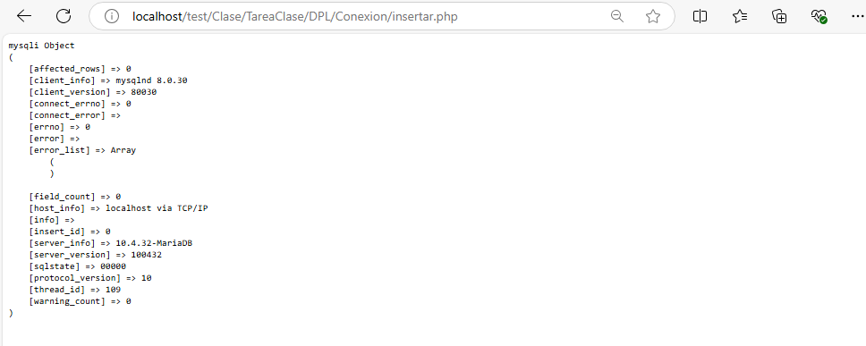
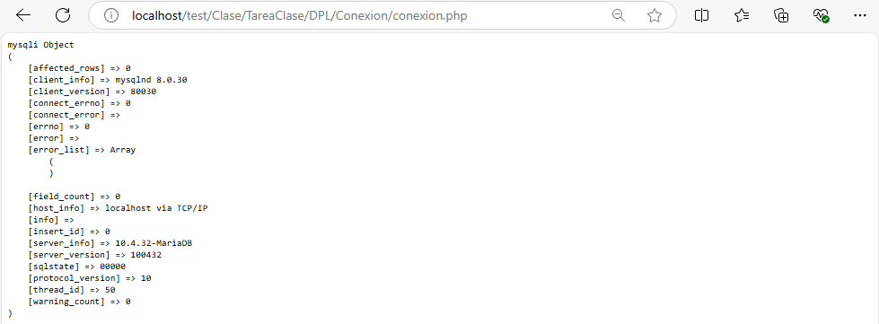

Levantamos en xampp los servicios de apache y myql

Vamos phpMyAdmin y le damos a nueva

Ponemos el nombre y le damos a crear

Ponemos nombre a nuestra tabla

LLenamos los datos en sus respectiva colummna

Al poner un campo en primary key nos saldra una pantalla asi, le damos a continuar y seguimos rellenado los datos en sus apartado correspondiente

Al poner toda la informacion como se muestra en las imagenes ya esta creado nuestra tabla

Creamos un archivo llamado conexion.php

